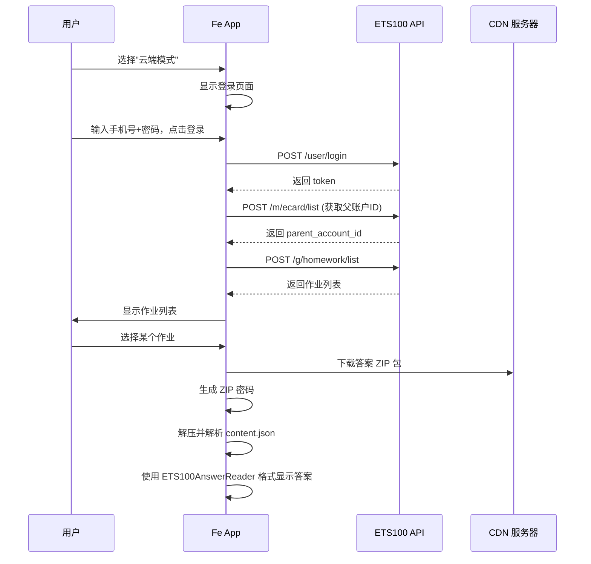

# Fe 云端模式实现计划

> 本文档描述"云端模式"的完整实现方案，用于从 ETS100 云端获取作业答案喵~

---

## 📌 概述

云端模式允许用户通过 ETS100 API 在线获取作业列表、下载答案包并解析显示，摆脱对本地文件的依赖。

### 核心功能

1. **账号登录** - 通过手机号和密码登录 ETS100 账号
2. **作业列表** - 获取账号下的所有作业
3. **答案下载** - 下载 ZIP 答案包并自动生成解压密码
4. **答案解析** - 按照 `ETS100AnswerReader` 的格式解析显示

---

## 🔐 API 配置

### 全局配置

```kotlin
object ETS100Config {
    const val API_BASE_URL = "https://api.ets100.com"
    const val CDN_BASE_URL = "https://cdn.subject.ets100.com"
    const val PID = "grlx"
    const val SECRET_KEY = "555ffbe95ccf4e9535a110170b445ab8"
}
```

### 签名算法

```
sign_string = PID + timestamp + content + SECRET_KEY
signature = MD5(sign_string).hexdigest()

其中:
- PID = "grlx"
- timestamp = Unix时间戳（秒）
- content = 请求体的 Base64 编码
- SECRET_KEY = "555ffbe95ccf4e9535a110170b445ab8"
```

---

## 📁 文件结构

### 新增文件

| 文件 | 说明 |
|------|------|
| `ETS100ApiClient.kt` | API 客户端，封装签名和 HTTP 请求 |
| `ETS100AuthManager.kt` | 认证管理器，处理登录状态和 Token 存储 |
| `ETS100MachineCode.kt` | 机器码生成器 |
| `CloudActivationScreen.kt` | 云端激活/登录页面 |
| `CloudHomeScreen.kt` | 云端首页，显示作业列表 |

### 修改文件

| 文件 | 修改内容 |
|------|----------|
| `MainActivity.kt` | 添加 `CLOUD` 到 `ActivationMode` 枚举，添加导航路由 |
| `ActivationScreen.kt` | 添加云端模式的激活面板 |
| `SettingsScreen.kt` | 添加云端模式切换入口 |

---

## 🏗️ 模块设计

### 1. ETS100ApiClient

API 客户端，负责所有网络请求喵~

```kotlin
object ETS100ApiClient {
    // API 端点
    object Endpoints {
        const val LOGIN = "/user/login"
        const val ECARD_LIST = "/m/ecard/list"
        const val HOMEWORK_LIST = "/g/homework/list"
    }
    
    // 请求配置
    object RequestConfig {
        const val DEFAULT_SN = "test"
        const val DEFAULT_VERSION = "3"
        const val DEFAULT_SYSTEM = "4"
        const val DEFAULT_DEVICE_NAME = "DESKTOP"
        const val DEFAULT_LOCAL_IP = "127.0.0.1"
    }
    
    // 生成签名
    fun generateSign(timestamp: Long, bodyBase64: String): String
    
    // 发送登录请求
    suspend fun login(phone: String, password: String, deviceCode: String): Result<LoginResponse>
    
    // 获取作业列表
    suspend fun getHomeworkList(token: String, parentAccountId: String): Result<HomeworkListResponse>
}
```

### 2. ETS100AuthManager

认证管理器，负责 Token 的存储和管理喵~

```kotlin
object ETS100AuthManager {
    // 保存登录信息
    fun saveLoginInfo(phone: String, token: String, parentAccountId: String)
    
    // 获取 Token
    fun getToken(): String?
    
    // 获取父账户 ID
    fun getParentAccountId(): String?
    
    // 检查是否已登录
    fun isLoggedIn(): Boolean
    
    // 登出
    fun logout()
}
```

### 3. ETS100MachineCode

机器码生成器，用于登录时的设备验证喵~

每设备固定，首次使用时随机生成，后续使用保存的值喵~

```kotlin
object ETS100MachineCode {
    // 机器码格式: data_md5|mac_md5 (各16字符，共33字符)
    // 首次使用时随机生成，保存在 SharedPreferences
    
    fun getDeviceCode(context: Context): String {
        val prefs = context.getSharedPreferences("ets100_auth", Context.MODE_PRIVATE)
        val savedCode = prefs.getString("device_code", null)
        
        if (savedCode != null) {
            return savedCode  // 返回已保存的机器码
        }
        
        // 首次生成：随机生成设备信息部分
        val deviceInfo = generateRandomDeviceInfo()  // 16字符的随机hex
        val macAddress = generateRandomMac()          // 16字符的随机hex
        
        val dataMd5 = md5(deviceInfo).uppercase().substring(8, 24)
        val macMd5 = md5(macAddress).uppercase().substring(8, 24)
        val newCode = "$dataMd5|$macMd5"
        
        // 保存
        prefs.edit().putString("device_code", newCode).apply()
        
        return newCode
    }
    
    // 生成随机设备信息 (用于 MD5 计算)
    private fun generateRandomDeviceInfo(): String {
        val chars = "0123456789ABCDEF"
        return (1..16).map { chars.random() }.joinString("")
    }
    
    // 生成随机 MAC 地址 (用于 MD5 计算)
    private fun generateRandomMac(): String {
        val chars = "0123456789ABCDEF"
        return (1..16).map { chars.random() }.joinString("")
    }
}
```

### 4. ZIP 密码生成

从 ZIP 文件数据生成解压密码喵~

```kotlin
object ZipPasswordGenerator {
    private const val FOOTER_SIZE = 336
    
    fun generatePassword(zipData: ByteArray): String {
        // 1. 提取尾部 336 字节
        val footer = zipData.takeLast(FOOTER_SIZE)
        
        // 2. 验证文件签名
        //    签名位置1: footer[0:8] == b'MSTCHINA'
        //    签名位置2: footer[144:149] == b'EPLAT'
        val signature1 = footer.sliceArray(0..7)
        val signature2 = footer.sliceArray(144..148)
        
        require(signature1.contentEquals("MSTCHINA".toByteArray()) || 
                signature2.contentEquals("EPLAT".toByteArray())) {
            "无效的文件签名"
        }
        
        // 3. 提取 128 字节种子数据 (偏移 16-143)
        val seed = footer.sliceArray(16..143)
        
        // 4. 第一次 MD5
        val firstMd5 = MD5(seed).hex().uppercase()
        
        // 5. 第二次 MD5
        val secondMd5 = MD5(firstMd5.toByteArray()).hex().uppercase()
        
        // 6. 拼接最终密码 (64字符)
        return firstMd5 + secondMd5
    }
}
```

---

## 🎨 UI 设计

### CloudActivationScreen

云端激活/登录页面，用于用户登录喵~

```
┌─────────────────────────────────┐
│  ←  云端模式                     │
├─────────────────────────────────┤
│                                 │
│     ☁️ 云端模式                  │
│     在线获取作业和答案            │
│                                 │
├─────────────────────────────────┤
│  📱 手机号                      │
│  ┌─────────────────────────┐   │
│  │ 请输入手机号              │   │
│  └─────────────────────────┘   │
│                                 │
│  🔒 密码                        │
│  ┌─────────────────────────┐   │
│  │ 请输入密码               │   │
│  └─────────────────────────┘   │
│                                 │
│  ┌─────────────────────────┐   │
│  │       登  录             │   │
│  └─────────────────────────┘   │
│                                 │
│  ┌─────────────────────────┐   │
│  │    📁 使用测试账号登录    │   │
│  └─────────────────────────┘   │
│                                 │
└─────────────────────────────────┘
```

### CloudHomeScreen

云端首页，显示作业列表喵~

```
┌─────────────────────────────────┐
│  ☁️ 云端作业列表            🔄  │
├─────────────────────────────────┤
│                                 │
│  📚 初三英语听说作业 #1          │
│     2024-01-15                  │
│     ┌───────────────────────┐   │
│     │    查看答案            │   │
│     └───────────────────────┘   │
│                                 │
│  📚 初二英语听说作业 #2          │
│     2024-01-14                  │
│     ┌───────────────────────┐   │
│     │    查看答案            │   │
│     └───────────────────────┘   │
│                                 │
└─────────────────────────────────┘
```

---

## 🔄 工作流程



---

## 📋 实现步骤

### 第一阶段：基础架构

1. **创建 ETS100ApiClient.kt**
   - [ ] 定义 API 配置常量
   - [ ] 实现签名生成算法
   - [ ] 实现 HTTP 请求封装
   - [ ] 实现登录 API
   - [ ] 实现作业列表 API

2. **创建 ETS100AuthManager.kt**
   - [ ] 使用 SharedPreferences 存储 Token
   - [ ] 实现登录状态检查
   - [ ] 实现登出功能

3. **创建 ETS100MachineCode.kt**
   - [ ] 定义机器码生成接口
   - [ ] 提供测试用固定机器码

### 第二阶段：ZIP 处理

4. **实现 ZipPasswordGenerator**
   - [ ] 实现密码生成算法
   - [ ] 验证 ZIP 文件签名
   - [ ] 实现 ZIP 解压功能

### 第三阶段：UI 实现

5. **修改 MainActivity.kt**
   - [ ] 添加 `CLOUD` 到 `ActivationMode` 枚举
   - [ ] 添加 CloudHomeScreen 导航路由

6. **创建 CloudActivationScreen.kt**
   - [ ] 登录表单 UI
   - [ ] 登录逻辑处理
   - [ ] 错误处理和 Toast 提示

7. **创建 CloudHomeScreen.kt**
   - [ ] 作业列表 UI
   - [ ] 下载和解析逻辑
   - [ ] 答案展示（复用 ReadScreen）

### 第四阶段：集成测试

8. **修改 ActivationScreen.kt**
   - [ ] 添加云端模式激活面板

9. **修改 SettingsScreen.kt**
   - [ ] 添加云端模式切换入口

10. **编译测试**
    - [ ] 验证编译通过
    - [ ] 测试登录流程
    - [ ] 测试作业列表获取

---

## ⚠️ 注意事项

### 机器码问题

由于这是 Android 应用，无法直接访问 Windows 注册表获取机器码。有以下解决方案：

1. **方案A：使用固定测试机器码**
   ```kotlin
   const val TEST_DEVICE_CODE = "test|test"
   ```
   适用于开发测试

2. **方案B：提示用户在 Windows 上获取**
   - 用户在 Windows 上运行一个脚本获取机器码
   - 将机器码输入到 Android 应用中
   - 应用保存机器码供后续使用

### Token 有效期

API 返回的 token 可能有有效期限制，需要处理 token 过期的情况喵~

### 网络错误处理

需要处理各种网络错误：
- 网络不可用
- 请求超时
- 服务器错误
- 登录失败（密码错误等）

---

## 🔧 参考资料

- [API 文档](../ets读取/API_DOC.md)
- [答案提取说明](../ets读取/ETS_100_答案提取说明.md)
- [现有答案读取器](../app/src/main/java/com/shuaiqiu/fuckets100/ETS100AnswerReader.kt)

---

*计划版本：1.0*
*更新日期：2026-05-05*